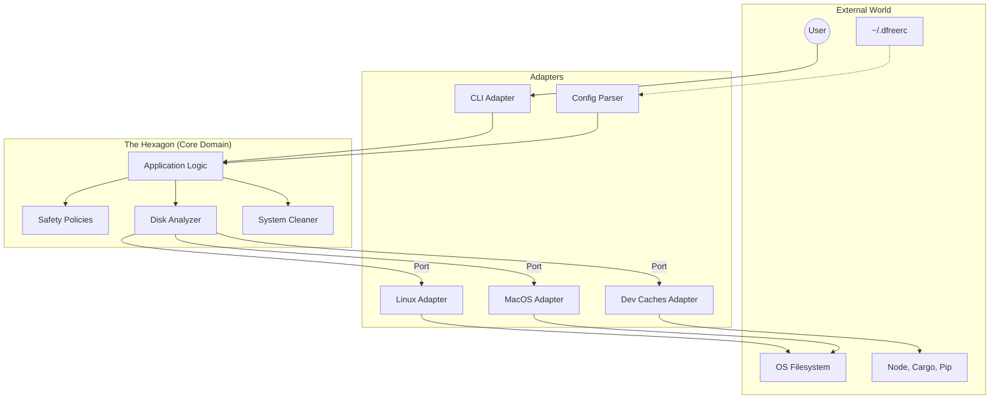

# Architecture: Developer Caches & Custom Rules

This document outlines the architectural design for introducing **Developer Cache Cleanups** and **Custom Configuration Rules** into `dfree`, maintaining the project's Hexagonal Architecture principles.

## 1. Feature: Developer Cache Cleanups

Developer caches (like npm, yarn, pip, cargo) consume significant disk space. Unlike OS-specific caches (`/var/cache` or `~/Library/Caches`), developer tools typically store caches in cross-platform locations (usually under `$HOME`).

### Architectural Placement
We will introduce a new infrastructure adapter under `src/adapters/runtime/` called `dev_caches.sh`. 

**Why an Adapter?**
The core domain (`analyzer.sh` and `cleaner.sh`) shouldn't hardcode specific developer tools. Instead, it will interact with a generic "Package Manager" port.

- **Port (Implicit)**: `PackageManager`
  - `get_dev_cache_paths()`: Returns a list of all detected developer cache paths on the system.
- **Adapter**: `src/adapters/runtime/dev_caches.sh`
  - Implements `get_dev_cache_paths()`.
  - Checks for the existence of tools (npm, cargo, pip) or their default folders (`~/.npm`, `~/.cargo/registry`, `~/.cache/pip`) and yields the paths.

### Core Integration
- **`src/core/analyzer.sh`**: Will call `get_dev_cache_paths()` to display disk usage of these specific caches.
- **`src/core/cleaner.sh`**: Will iterate through `get_dev_cache_paths()`, present them to the user, and clean them if confirmed.
- **`src/core/safety.sh`**: The paths returned by the dev caches will be dynamically added to the allowed safety list (or the safety rules will greenlight `$HOME/.[name]` directories belonging to known dev tools).

## 2. Feature: Custom Rules / Configuration File

Users need the ability to specify custom directories to clean or directories to protect, using a configuration file like `~/.dfreerc`.

### Architectural Placement
We will introduce a new configuration parser. This acts as an input Adapter (driving the app) or a provider Adapter (driven by the app). In our case, it provides data to the Core, so it's a provider.

- **Adapter**: `src/adapters/config/parser.sh`
  - Parses a standard `~/.dfreerc` file.
  - Formats could be basic `bash` variables like `DFREE_CUSTOM_PATHS=("/tmp/mycache")` and `DFREE_EXCLUDED_PATHS=("/important/data")`.
  - Safely sources or parses this file.

### Core Integration
- **`src/core/app.sh`**: During initialization (`app_start`), it will invoke the config parser to load user preferences into global environment variables.
- **`src/core/cleaner.sh` & `src/core/analyzer.sh`**: Will process the paths defined in `DFREE_CUSTOM_PATHS` alongside default system caches.
- **`src/core/safety.sh`**: 
  - Will explicitly **allow** deletion of any path within `DFREE_CUSTOM_PATHS`.
  - Will explicitly **deny** deletion of any path within `DFREE_EXCLUDED_PATHS`, acting as a hard override (even if a directory is a known cache).

## Updated Hexagonal Diagram

