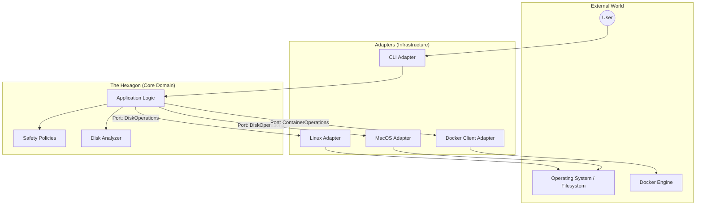

# Architecture: dfree

## 1. Architectural Style: Hexagonal (Ports & Adapters)

To ensure **safety**, **testability**, and **portability** (Linux/macOS support), `dfree` adopts a **Hexagonal Architecture**.

This style separates the application into distinct layers:
1.  **Core Domain (Hexagon)**: Pure business logic. It decides *what* to clean and *when*, but never executes system commands directly. It is isolated from the OS.
2.  **Ports**: Interfaces that the Core uses to interact with the outside world (e.g., "Get Disk Usage", "Delete File").
3.  **Adapters**: Implementations of the Ports for specific environments (e.g., "Linux `df` Adapter", "MacOS `rm` Adapter", "Interactive CLI Adapter").

### Design Diagram



---

## 2. Core Domain

The core logic (located in `src/core/`) is responsible for higher-level decisions and orchestration. It is **pure bash logic** that does not call `rm`, `df`, or `docker` directly.

### Responsibilities
-   **Analysis Strategy**: Orchestrates which paths to check based on the OS.
-   **Safety Rules**: Validates if a path is safe to delete (e.g., "Is this path in the allowed list?", "Is it a system directory?").
-   **Cleanup Workflow**: Manages the interactive flow (Scan -> Report -> User Confirm -> Clean -> Verify).
-   **Statistics**: Calculates space reclaimed.

---

## 3. Ports (Interfaces)

Since Bash doesn't have strict "interfaces" or "classes", ports are defined by **convention** and **function signatures**.

### Primary Ports (Input)
-   **`Drive Application`**: The entry point for the CLI to start the application (e.g., `app_start`, `app_scan`, `app_clean`).

### Secondary Ports (Output)
-   **`DiskUsageProvider`**:
    -   `get_total_space()`
    -   `get_used_space()` 
    -   `get_directory_size(path)`
-   **`SystemCleaner`**:
    -   `delete_file(path)`
    -   `delete_directory(path)`
    -   `empty_trash()`
-   **`ContainerEngine`**:
    -   `get_unused_images()`
    -   `get_stopped_containers()`
    -   `prune_system()`
-   **`UserInterface`**:
    -   `ui_print_header(text)`
    -   `ui_ask_confirmation(prompt)`
    -   `ui_show_progress(current, total)`

---

## 4. Adapters

### Driver Adapters (Driving the App)
-   **CLI Adapter (`src/adapters/ui/cli.sh`)**:
    -   Parses arguments (`--help`, `--simulate`).
    -   Handles user input/interaction.
    -   Calls the Core Domain to start processes.

### Infrastructure Adapters (Driven by App)
-   **Linux Adapter (`src/adapters/os/linux.sh`)**:
    -   Implements `DiskUsageProvider` using `df -B1` and `du -sb`.
    -   Implements `SystemCleaner` using `rm`, `journalctl --vacuum`.
    -   OS-specific paths: `/var/log`, `/var/cache/apt`.
-   **MacOS Adapter (`src/adapters/os/macos.sh`)**:
    -   Implements `DiskUsageProvider` using `df -H` and `du -sk`.
    -   Implements `SystemCleaner` using `rm`.
    -   OS-specific paths: `~/Library/Caches`, `~/Library/Logs`.
-   **Docker Adapter (`src/adapters/runtime/docker.sh`)**:
    -   Wraps `docker system df` and `docker system prune`.

---

## 5. Directory Structure

```text
dfree/
├── bin/
│   └── dfree                 # Entry point script
├── src/
│   ├── core/                 # THE HEXAGON
│   │   ├── app.sh            # Main application loop
│   │   ├── safety.sh         # Safety checks & allowed paths
│   │   ├── analyzer.sh       # Logic to aggregate disk usage
│   │   └── cleaner.sh        # Logic to coordinate cleanup
│   │   └── stats.sh          # Logic for tracking reclaimed space
│   ├── ports/                # Interface definitions (documentation/stubs)
│   │   ├── storage.sh        # DiskUsageProvider & SystemCleaner definitions
│   │   └── ui.sh             # UserInterface definitions
│   ├── adapters/             # IMPLEMENTATIONS
│   │   ├── os/
│   │   │   ├── linux.sh      # Linux implementation of storage port
│   │   │   ├── macos.sh      # MacOS implementation of storage port
│   │   │   └── common.sh     # Shared utils (e.g., safe_rm)
│   │   ├── docker/
│   │   │   └── client.sh     # Docker implementation
│   │   └── ui/
│   │       ├── text.sh       # Standard text output
│   │       └── colors.sh     # ANSI color codes
│   └── boot/
│       └── bootstrap.sh      # Dependency injection & OS detection
├── tests/                    # Tests
│   ├── unit/                 # Tests for core/ mocking adapters
│   └── integration/          # Tests running against real OS (careful!)
└── config/
    └── settings.conf         # User overrides
```

## 6. Deployment Strategy

The application is installed via `install.sh` which:
1.  Copies the source tree to `/usr/local/lib/dfree`.
2.  Symlinks `/usr/local/bin/dfree` to `bin/dfree`.

This keeps the modular structure intact on the target system, allowing for easy updates and maintenance.
